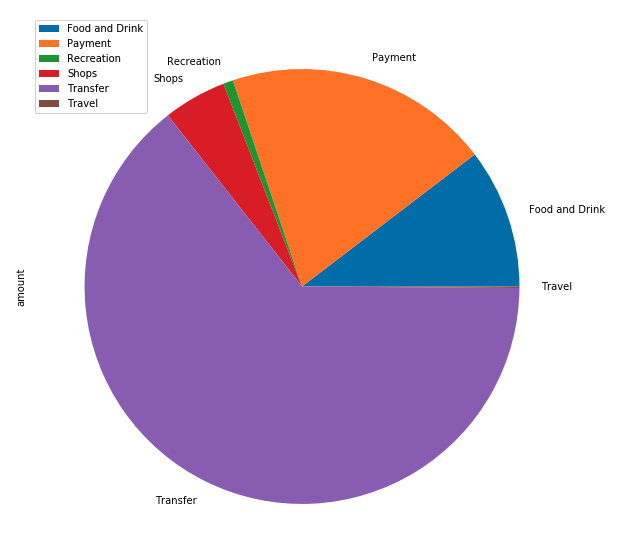
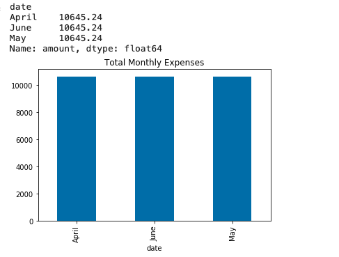

# API Budget Analysis; Retirement Planner

## Background

This application offers budgeting and financial planning services to customers by generating reports that links to their banking and investment accounts and automatically refreshes the data and charts on login. However, some of the calculations are tricky, To connect the accounts and simulate the retirement investment projections. I have generated a Plaid API and Alpaca API to obtain account transactions and fetch retirement portfolio prices.

Included in this repo is a budgest analysis with Plaid, a retirement planner and a financial report summarizing the results. 

---

## Notebooks

### Budget Analysis

The budget analysis uses the Plaid API to obtain transaction and account data. The following steps outlined below were performed to produce the report

1. Generate a Plaid access token to access the Developer Sandbox.

2. Use the Access token to fetch account transactions from the sandbox. Fetch the last 90 days of transactions from the sandbox.

3. Perform basic budget analysis on the sandbox transaction and generate plots for the following:

    * Spending Categories Pie Chart.
    
    

    * Spending Per Month Bar Chart.
    
    

4. Use the API to fetch income data from the sandbox and print the following:

    * Last Year's Income Before Tax.

    * Current Monthly Income.

    * Projected Year's Income Before Tax.

### Retirement Planner

In this section, the Alpaca API was used to fetch historical closing prices for a retirement portfolio. Then I ran a Monte Carlo simulations to project the portfolio performance at 30 years. The following steps outlined below were performed to produce the report 

#### Monte Carlo Simulation

Create a Monte Carlo simulation for the retirement portfolio:

1. Use the Alpaca API to fetch historical closing prices for a traditional 60/40 portfolio using the `SPY` and `AGG` tickers to represent the `60%` stocks (`SPY`) and `40%` bonds (`AGG`).

2. Run a Monte Carlo simulation of `500` runs and `30` years for the `60/40` portfolio and plot the results.

    

3. Select the ending cumulative returns from the Monte Carlo simulation and calculate the interval values for a `90`% confidence interval.

4. Using the ending cumulative returns, plot a histogram of the results and plot the `90%` confidence interval as vertical lines on the histogram.

    

#### Retirement Analysis

Use the Monte Carlo simulation we to answer the following questions:

1. What are the expected cumulative returns at `30` years for the `10th`, `50th`, and `90th` percentiles?

2. Given an initial investment of `$20,000`, what is the expected return in dollars at the `10th`, `50th`, and `90th` percentiles?

3. Given the current projected annual income from the Plaid analysis, will a `4%` withdrawal rate meet or exceed that value at the `10th` percentile? Note: This is basically determining if retirement income is equivalent to current income.

4. How would a `50%` increase in the initial investment amount affect the `4%` retirement withdrawal? In other words, what happens if the initial investment had been bigger?

5. (Optional Challenge +5 bonus points) Use the Monte Carlo data and calculate the cumulative returns at the `5%`, `50%`, and `95%` quartiles and plot this data as a line chart to see how the cumulative returns change over the life of the investment.

    

### Financial Report

In the Financial Planner .md, you will find the following sections:

1. **Budget Analysis:** A Summary of the transaction data from the budget analysis and images for each chart and table produced.

2. **Retirement Planning:** A Summary of the retirement portfolio analysis and the charts for the Monte Carlo simulation.

### Optional Challenge — Early Retirement - Up to 10 bonus points

Harold is impressed with your work on this planner, but thinks that `30` years seems like a very long time to wait to retire! Harold wants to know if the retirement plan could be adjusted to retire earlier than normal. Try adjusting the portfolio to either include more risk (a higher stock than bond ratio), or to have a larger initial investment and then rerun the retirement analysis to see what it would take to retire in `5` years, instead of `30`!

---

### Resources

* [Plaid API Docs](https://plaid.com/docs/)

* [AlpacaDOCS](https://alpaca.markets/docs/)

---

